# Recovering Deleted Files - Forensics :detective:

* Did you know that even deleting a file from a device, it remains accessible? Did you know that we can recover this data? With this concept of file recovery, we can also mention the problems of leakage and unauthorized data access when a **HD/SSD/PENDRIVE** is discarded incorrectly. The people who may be looking for this data are called **Dumpster Diving**.

> [!IMPORTANT]
The **Dumpster diving** is looking for treasure in someone else's trash. In the world of information technology (IT), dumpster diving is a technique used to retrieve information that could be used to carry out an attack or gain access to a computer network from disposed items.

  

* In this document we will use one of the forensic techniques used to recover and analyze system files. For the study, we will **Create** and **Remove** files on drive 'E:', below.

  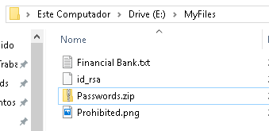

# What will we use :question:

* In our study we will use 2 programs, one to create an image of the target disk and the other to analyze this data.

    * **FTK Imager** - FTK Imager is a free Digital Forensics tool. It has features especially for acquiring evidence derived from storage units. In this case, we will use the Windows version, available at [FTK Imager](https://www.exterro.com/ftk-product-downloads/ftk-imager-version-4-7-1)

    

        
    

    * **Autopsy** - Autopsy is a tools for cyber first responders to intrusions, crime scenes, and war zones. It will be used in conjunction with FTK to analyze the generated data. We can find it for Windows here [Autopsy](https://www.autopsy.com/download/)

    

        
    

    
# Disk Image :cd:

* A disk image file is a file that contains a bit-by-bit copy of a disk drive. A bit-by-bit copy saves all the data in a disk image file, including the metadata, in a single file. For this step, we will use **FTK Imager**.

1. Go to 'File -> Create Disk Image'.

    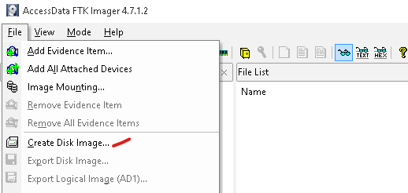

2. Set 'Logical Driver'.
 

    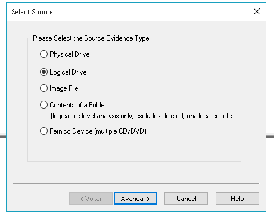

3. Set your Drive.
 

    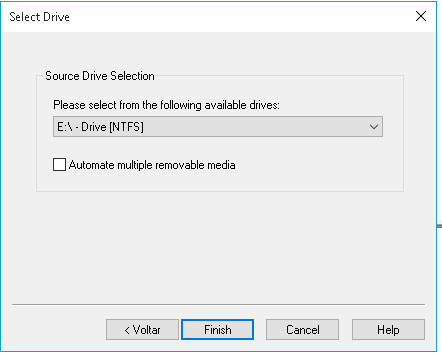

4. choose type 'E01', this type will be imported into autopsy.
 

    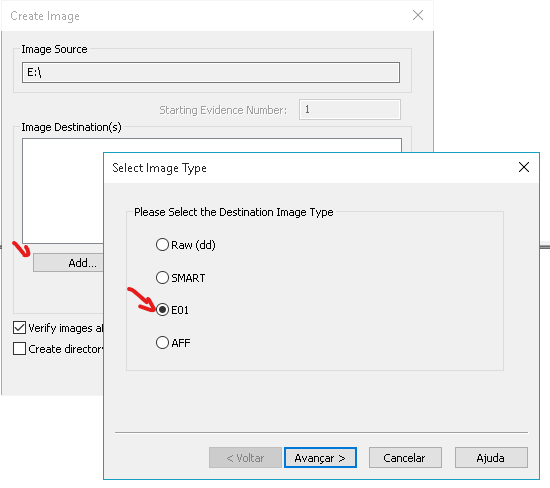

5. In Item Information, This field is used to record evidence, this information is not necessary. In the destination, we place where the record will be saved.
 

    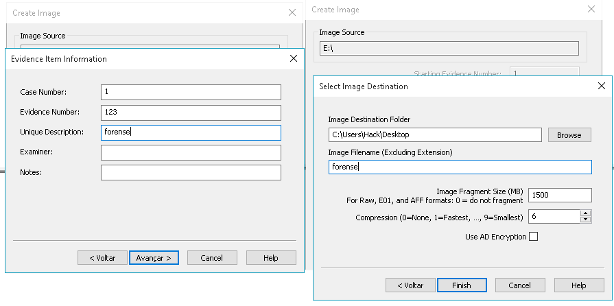

6. Working... When finished, the **forense.E01** file will be generated.
 

    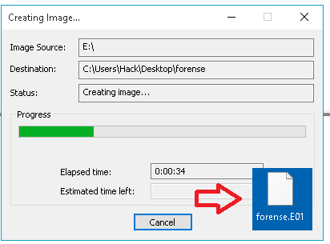

# Recovering the Files :floppy_disk:

* After generating the evidence files using FTK Imager, we can analyze and recover the deleted files using Autopsy. Let's go.

1. Let's generate a 'new case'.
 

    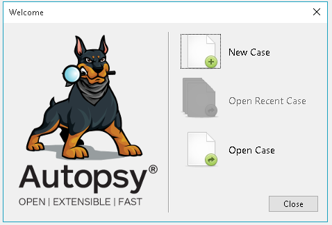

2. We inform the name of the case and the destination of the logs.
 

    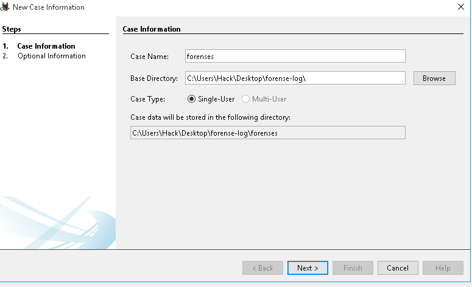

3. Here we will select a disk image.
 

    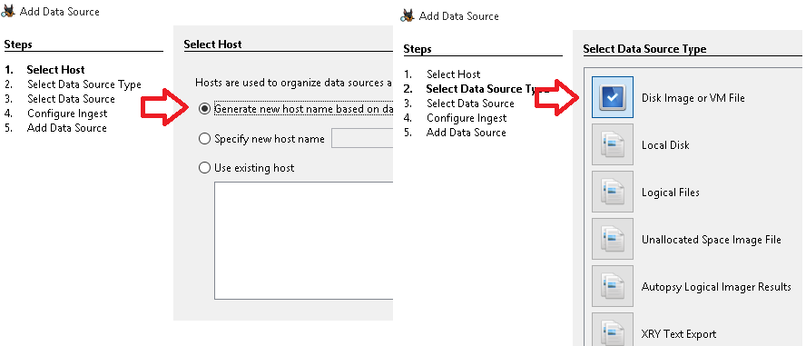

4. We choose our E01 file.
 

    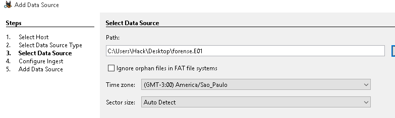

5. Here we can view all our deleted files.
 

    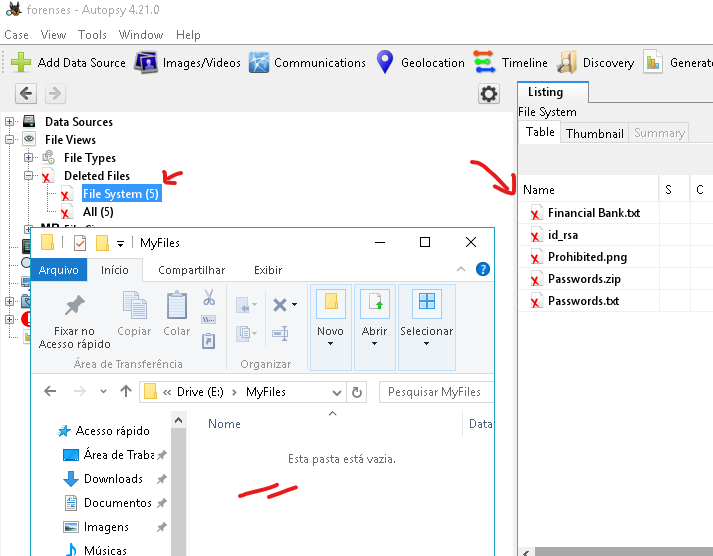

6. Extracting the files, we were able to access all the files again.
 

    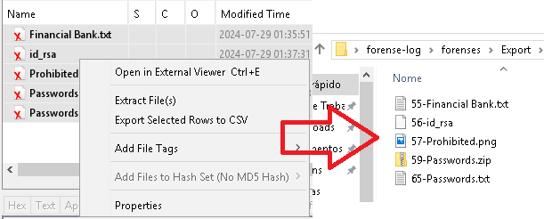

# Final evidence :mag:

* Below we were able to open all the files that were deleted on our disk E:.

 

    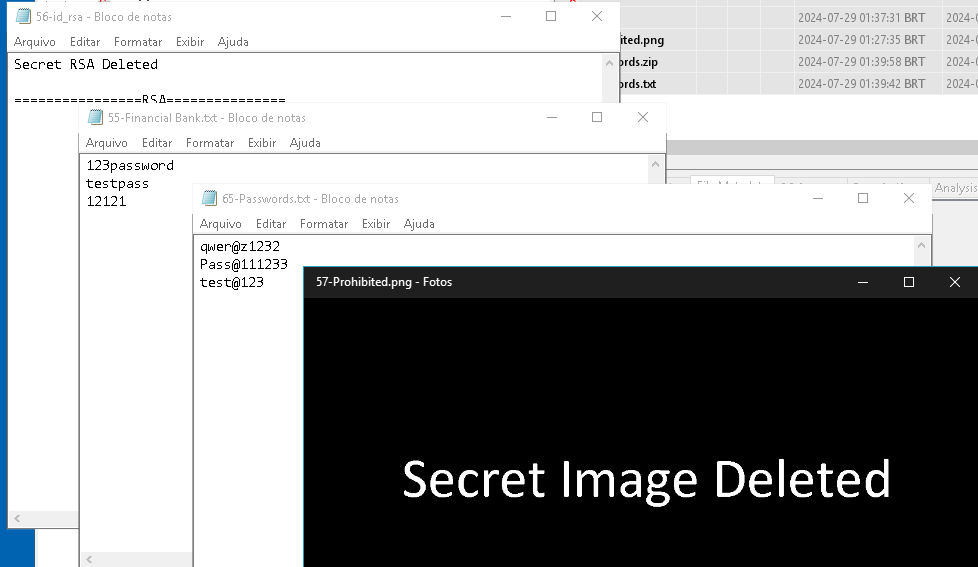

* This happens because when deleting a file, only a reference to the Block/Sector where the file is located is removed, however, as long as the space is not overwritten, the file remains on the disk and can be recovered.

 

    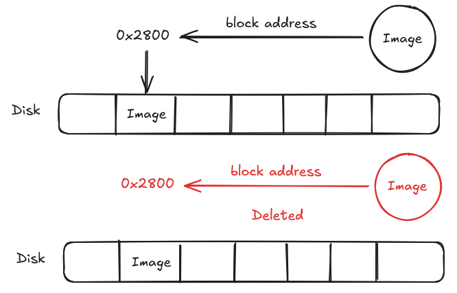

* In the simple example above, we can see that when deleting a file, the block reference is removed, however, the file remains on the disk.

---

  

Hope this helps. To the next

